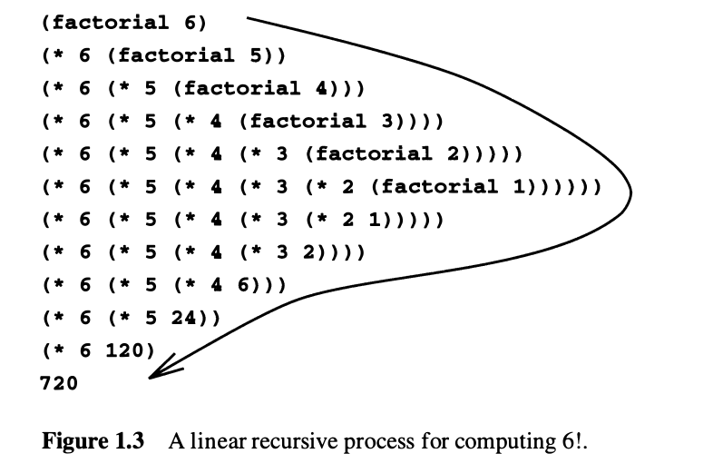
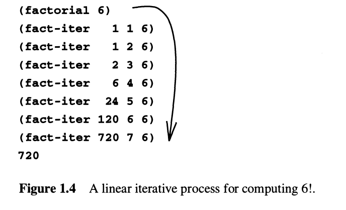
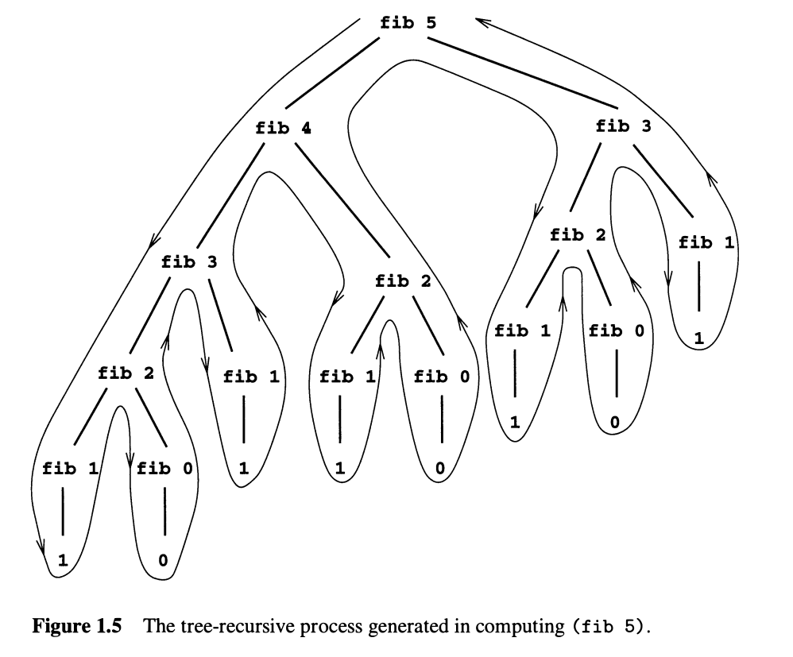

## Building Abstractions with Procedures

### The Elements of Programming

- **Primitive expressions**, which represent the simplest entities the lan­
guage is concerned with,
- **Means of combination**, by which compound elements are built from
simpler ones, and
- **Means of abstraction**, by which compound elements can be named
and manipulated as units.

---

### Expressions

You type an *expression*, and the interpreter responds by displaying the result 
of its *evaluating* that expression.

Advantages of *prefix notation*: 
- Takes an arbitrary number of arguments
- Allows combinations to be *nested* (therefore, having no limit (in theory) to 
the nesting and overall complexity of the expressions) 

```
(+ 137 349)
486
```

More complex expresisons can be formatted as such:

```
(+ (* 3
        (+ (* 2 4)
            (+ 3 5 ) ) )
    (+ ( - 1 0 7)
        6) )
```

---

### Naming and Environment

The name identifies a *variable* whose *value* is the object.

In Scheme, we use `define`. This being the language's simplest means of abstraction.

Incremental development by using name-object associations.

```
(define pi 3 . 1 4 1 59)
(define radius 1 0 )
(* p i (* radius radius ) )
314.159
```

The interpreter must maintain some sort of memory that keeps track of the 
name-object pairs. This memory is called the *environment* (more precisely the 
*global environment*.

---

### Evaluating Combinations

Thinking procedurally, when evaluating a combination:

1. Evaluate the subexpressions of the combination.
2. Apply the procedure that is the value of the leftmost subexpression
(the operator) to the arguments that are the values of the other subex­
pressions (the operands

The expression is *recursive* in nature:

```
(* (+2 (*4 6))
    (+ 3 5 7))
```


---

The "percolate values upward" form of the evaluation is an example of a general 
kind of process known as *tree accumulation*.

It is interesting to note that symbols such as `+` or `*` are also included in 
the global environment, and are associated with the sequences of machine instructions
that are their "values".

*Special forms* are exceptions to the general evaluation rules. For instance, 
evaluating `define x 3` does not apply `define` to two arguments. The purpose 
of `define` is to associate `x` with a value (That is, `define x 3` is not a 
combination.)
- Each special form has its associated evaluation rule
- The various kinds of expressions (each with its associated evaluation rule),
constitute the syntax of the programming languge

---

### Compound Procedures

We identified:
- Numbers and arithmetic operations are primitive data and procedures.
- Nesting of combinations provides a means of combining operations.
- Definitions that associate names with values provide a limited means
of abstraction.

---

*Procedure definitions*

A *compound procedure*, which has been given the name `square`: 
```
(define (square x) (* x x))
```
The general form of a procedure definition is:
```
(define (<name> <formal parameters>) <body>)
```

The `<name>` and `<formal parameters>` are grouped within parantheses, just as 
they would be in an actual call to the procedure being defined.

Further compounding enables us to do things like:
```
(define (sum-of-squares x y)
    (+ (square x) (square y)))

(sum-of-squares 3 4 )
25
```

---

*The substitution model*

The process is reducing expressions for procedure application. 

\* The way an interpreter works is more nuanced. Especially when we are talking 
about mutable data..

```
(f 5) 

(sum-of-squares (+ a 1) (* a 2))

(sum-of-squares (+ 5 1) (* 5 2))

(+ (square 6) (square 10))

(+ (6 6) (10 10))

(+ 36 100)

136
```

---

**Applicative order vs normal order**

- Evaluate the operator and operands and then apply the resulting procedure to 
the resulting arguments

vs

- Don't evaluate the operands until their values are needed. First substitute
operand expressions for parameters until you obrain an expression involving 
only primitive operators,  and then perform the evaluation

```
(f 5) 

(sum-of-squares (+ 5 1) (* 5 2))

(+ (square (+ 5 1)) (square (* 5 2)))

(+ (* (+ 5 1) (+ 5 1)) (* (* 5 2)(* 5 2)))

(+ (* 6 6) (* 10 10))

(+ 36 100)

136
```

This is called *normal-order evaluation* which is in contrast to the method
that the interpreter actually uses, which is called *applicative-order evaluation*.

---

### Conditional Expressions and Predicates

*Case analysis*
In Lisp we use it with `cond`.

The general form would be:

```
(cond (<p1> <e1>)
      (<p1> <e1>)
      .
      .
      .
      (<p1> <e1>)
```

Where: 
- (\<p> \<e>) = clause
- `<p>`       = predicate  
- `<e>`       = consequent expression.
- else        = fallback

You can write absolute-value procedures in different ways:

```
(define (abs x)
    (cond ((> x 0) x)
          ((= x 0) 0) 
          ((< x 0) (- x))))

---

(define (abs x)
    (cond ((< x 0) (- x))
          (else x)))

---

(define (abs x)
    (if (< x 0)
        (- x)
        x))
```

Essentially, they all follow:

(if <*predicate*> <*consequent*> <*alternative*>)

---

There are also logical composition operations that enable us to construct 
compound predicates. For example:

- (`and` <*e1*> ... <*en*>)
- (`or`  <*e1*> ... <*en*>)
- (`not` <*e*>)

\* `and` and `or` are special forms, not procedures, because the subexpressions 
are not necessarily all evaluated. `Not` is an ordinary procedure.

---

### Procedures as Black-Box abstractions

The program `sqrt-iter` (./ch01/exercises/1.7.rkt) can be seen as a cluster of
procedures that decomposes the problem into subproblems.

With its modularity, the `good-enough?` procedure is defined in terms of `square`
; the `sqaure` procedure can be regarded as a "black box". I.e. we are not 
concerned with *how* the procedure computes its result, only with the fact that
it computes the square.

Then, as far as `good-enough?` is concerned, `square` is not quite a procedure 
but rather an abstraction of a procedure - a so-called *procedural abstraction*.

#### Local names

The meaning of a procedure should be independent of the parameter names used 
by its author. Therefore, the parameter names should be local to the body of 
the procedure. 

If the parameters were not local: `x` in `square` could be confused with `x` 
in `good-enough?`. Also, then square will not be a proper black box.

---

The name of the formal parameter of a procedure does not matter. 

- Such a name is called a *bound variable*. The procedure definition *binds* its 
formal parameters.
- If a variable is not bound, it is *free*.

The set of expressions for which a binding defines a name is called the *scope*
of that name.

\* A variable can change from free -> bound if you *capture* allocated names 
like `abs`, `square`, `<`, etc.

---

#### Internal definitions and block structure


If you want to have auxiliary procedures that are named the same you could nest 
definition into a *block structure*.

```
(define (sqrt x)
    (define (good-enough? guess x)
        (< (abs - (square guess) x)) 0.001)
    ...
```

Even better, you can allow `x` to be a free variable in the internal definitions.

```
(define (sqrt x)
    (define (good-enough? guess )
        (< (abs - (square guess) x)) 0.001)
    ...
```

This discipline is called *lexical scoping*.

---

### Procedures and the Processes They Generate

- Common "shapes" for processes generated by simple procedures
- The rates at which these processes consume the important computational resources
of time and space

#### Linear Recursion and Iteration

n! = n (n-1)!

```
(define (factorial n)
    (if (= n 1)
        1
        (* n (factorial (- n 1)))))
```



We could also do:

```
product <- counter * product

counter <- counter + 1
```

And then stipulating that *`n!`* is the value of the product when the counter 
exceeds *n*.

```
(define (factorial n)
    (fact-iter 1 1 n))

(define (fact-iter product counter max-count)
    (if (> counter max-count)
        product
        (fact-iter (* counter product)
                   (+ counter 1)
                   max-count)))
```



---

In figure 1.3 - a chain of *deferred operations* which is a type of process 
called a *recursive process*. 

The interpreter keeps track of the operations needed to be performed later on.
Since this grows linearly with *n*, this is called a *linear recursive process*.

vs

By contrast, the second process does not grow and shrink. We call this an 
*iterative process*. In general, an interative process is one whose state can 
be sumarized by a fixed number of *state variables*, together with a fixed 
rule that describes how the state variables should be updated as the process 
moves from state to state. Here, the number of steps grows linearly with *n*, 
therefore it's a *linear iterative process*.

Recursive process -> How the process evolves
Recursive procedure -> Syntax

---

`fact-ter` is a recursive procedure generating an iterative process. Its state
is captured by its three state variables in order to execute the process.

"As a consequence, these languages can describe iterative processes only by 
resorting to special-purpose "looping constructs" such as do, repeat, until, 
for, and while. The implementation of Scheme we shall consider in chapter 5 
does not share this defect." <- Savage..

---

In Scheme, we will execute an iterative process in constant space, even if the 
iterative process is described by a recursive procedure. An implementation with
this property is called *tail-recursive*.

---

#### Tree Recursion

A common example for this is computing the swquence of Fibonacci numbers.

```
Fib(n) = |0                 if n = 0
         |1                 if n = 1
         |Fib(n-1)+Fib(n-2) otherwise
```

Therefore:

```
(define (fib n)
   (cond ((= n 0)) 0)
         ((= n 1)) 1)
         (else (+ (fib (- n 1))
                  (fib (- n 2))))))
```



Almost half of the work is duplicated. 

- The process uses a number of steps that grows exponentially with the input.
- The space required grows linearly with the input. 

In general, the number of steps required by a tree-recursive process will be 
proportional to the number of nodes in the tree, while the space required
will be proportional to the *maximum depth* of the tree.

---

We can also formulate an iterative process for computing these numbers.

```
(define (fib n)
    (fib-iter 1 0 n)

(define (fib-iter a b count)
    (if (= count 0)
        b
        (fib-iter (+ a b) a (- count 1))))
```

This method of computing Fib(n) being a linear iteration.

---
