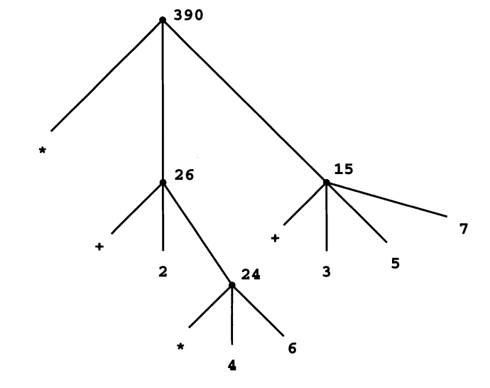

## Building Abstractions with Procedures

### The elements of programming

- **primitive expressions**, which represent the simplest entities the lan­
guage is concerned with,
- **means of combination**, by which compound elements are built from
simpler ones, and
- **means of abstraction**, by which compound elements can be named
and manipulated as units.

---

### Expressions

You type an *expression*, and the interpreter responds by displaying the result 
of its *evaluating* that expression.

Advantages of *prefix notation*: 
- takes an arbitrary number of arguments
- allows combinations to be *nested* (therefore, having no limit (in theory) to 
the nesting and overall complexity of the expressions) 

```
(+ 137 349)
486
```

More complex expresisons can be formatted as such:

```
(+ (* 3
        (+ (* 2 4)
            (+ 3 5 ) ) )
    (+ ( - 1 0 7)
        6) )
```

---

### Naming and Environment

The name identifies a *variable* whose *value* is the object.

In Scheme, we use `define`. This being the language's simplest means of abstraction.

Incremental development by using name-object associations.

```
(def ine pi 3 . 1 4 1 59)
(def ine radius 1 0 )
(* p i (* radius radius ) )
314.159
```

The interpreter must maintain some sort of memory that keeps track of the 
name-object pairs. This memory is called the *environment* (more precisely the 
*global environment*.

---

### Evaluating Combinations

Thinking procedurally, when evaluating a combination:

1. Evaluate the subexpressions of the combination.
2. Apply the procedure that is the value of the leftmost subexpression
(the operator) to the arguments that are the values of the other subex­
pressions (the operands

The expression is *recursive* in nature:

```
(* (+2 (*4 6))
    (+ 3 5 7))
```



---

The "percolate values upward" form of the evaluation is an example of a general 
kind of process known as *tree accumulation*.

It is interesting to note that symbols such as `+` or `*` are also included in 
the global environment, and are associated with the sequences of machine instructions
that are their "values".
